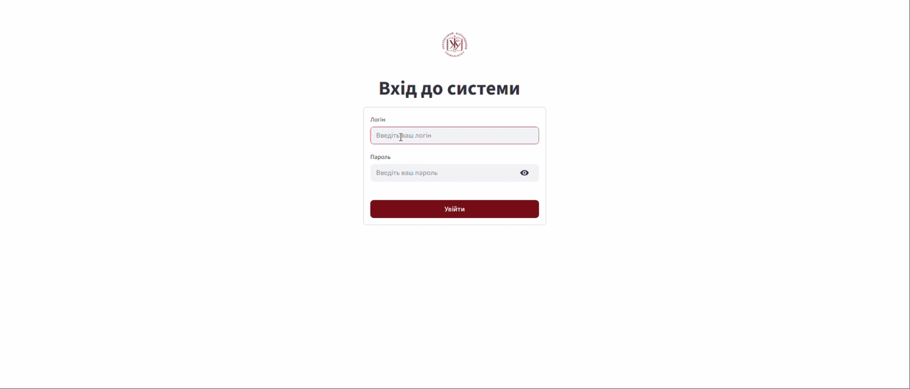

# 🎓 RAG-Based Employee Support Assistant for UCU Administrative Knowledge Base

An intelligent support assistant for Ukrainian Catholic University (UCU) employees, built using **Retrieval-Augmented Generation (RAG)** architecture. This project was developed as a Bachelor's Thesis at the Faculty of Applied Sciences at UCU.

## Key Features
* **Semantic Search:** Powered by the `multilingual-e5-large` model, specifically optimized for understanding the Ukrainian language and UCU-specific context.
* **Role-Based Access Control (RBAC):** Secure data retrieval using metadata filtering in Qdrant, distinguishing between public and internal documents.
* **Source Attribution:** Responses are grounded in the university's knowledge base with direct citations of the source documents.
* **Containerized Architecture:** Seamless deployment using Docker and Docker Compose for all system components.

## Repository Structure

The project is organized to separate production code from research and experimental data:

```text
├── app                        # Streamlit frontend and FastAPI backend logic     
├── data_ingestion             # Pipeline for processing and indexing data      
├── db_init                    # Initial tables for PostreSQL for texts, users, and roles
├── rag_pipeline_experiments   # Retrieval and generation RAG evaluation
├── textualization_methods     # Textualization experiments and evaluation
├── .gitignore                 # Files that are used locally but not pushed to Git      
├── Dockerfile                 # Docker image configuration 
├── README.mb                  # Docker image configuration
├── docker-compose.yml         # Orchestration of Streamlit, FastAPI, Qdrant, and PostreSQL
└── requirements.txt           # Python dependencies
```     

## Tech Stack

- Language: Python 3.10+
- Texts and User Data Storage: PostgreSQL
- Vector Database: Qdrant
- Embeddings: intfloat/multilingual-e5-large (HuggingFace)
- Frontend: Streamlit
- Backend: FastAPI
- DevOps: Docker & Docker Compose

## Setup

### STEP 1: Clone Git repository using the following command.
```bash
git clone
cd ucu-employee-support-rag
```

### STEP 2: Create .env file in the root directory and include all your API keys there.

### STEP 3: Run with Docker.
```bash
docker-compose up --build
```

Note:
The repository does not include pre-indexed data or access to the original Google Drive source for privacy reasons. 
To use the system, you must:
1. Create your own Google Drive folder with documents.
2. Set up your own Google Cloud credentials (service account or OAuth).
3. Run the ingestion pipeline to populate your local Qdrant instance.


